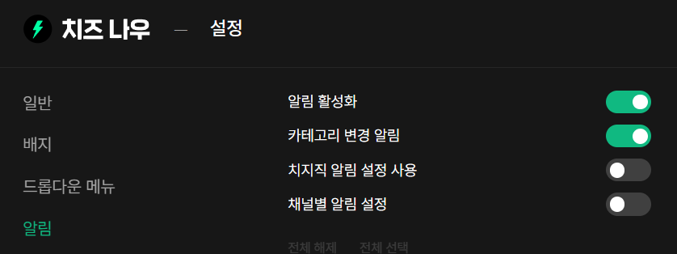
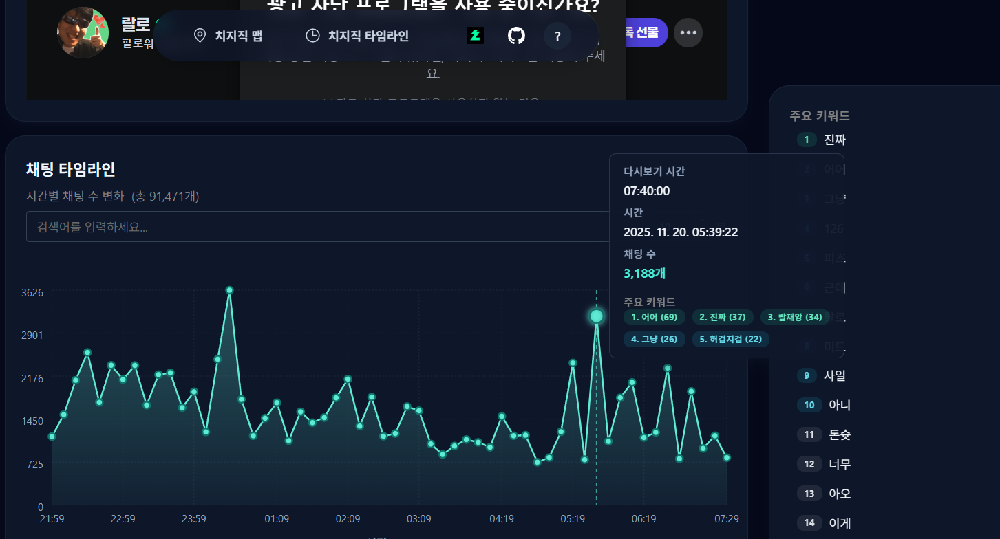
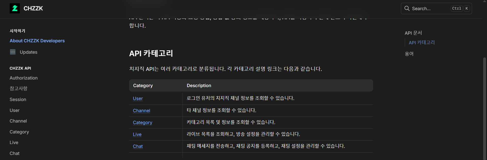
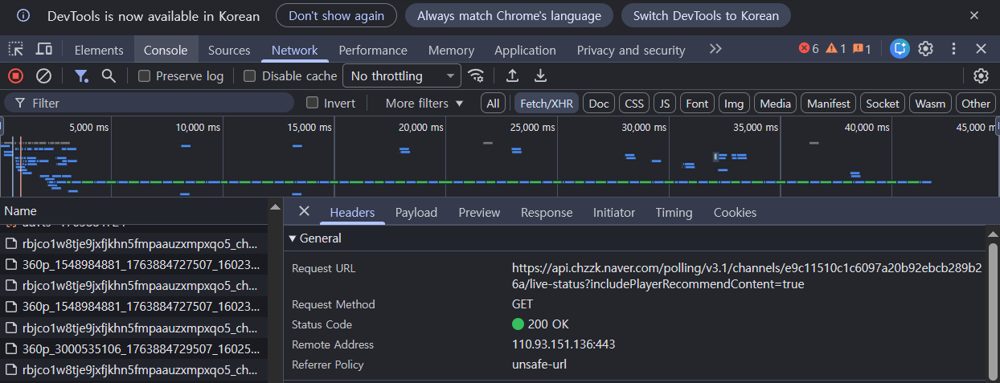
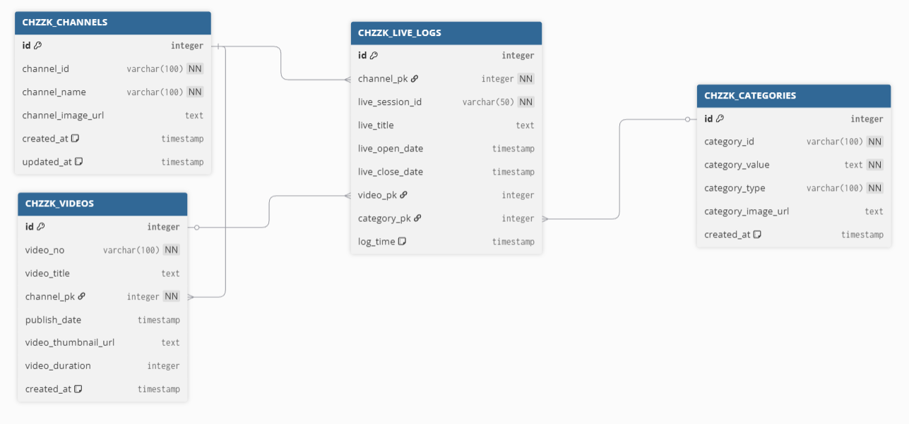
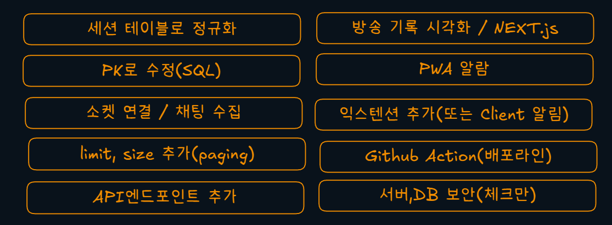

> 프로젝트 링크: [https://iftype.github.io/chzzk-client/](https://iftype.github.io/chzzk-client/)  
> 클라이언트 레포: [https://github.com/iftype/chzzk-client](https://github.com/iftype/chzzk-client)   
> 서버 레포: [https://github.com/iftype/chzzk-server](https://github.com/iftype/chzzk-server)
## 프로젝트 개요
`우테코`의 오픈 미션으로  **치지직의 방송 변경 내역을 기록하는 서비스** 를 구현했습니다.   
 스트리머의 실시간 방송 정보를 수집하여, 카테고리나 방송 제목의 변경 이력을 추적하고 해당 방송의 다시보기를 연결하여 제공합니다.

클라이언트는 `GitHub Pages`에 배포되어 있으며,  
서버는 `Oracle Cloud`의 `Ubuntu` 인스턴스에서 `Express.js`로 운영됩니다.

##  🛠Tech Stack
- Frontend: Vanilla JavaScript, HTML, CSS
- Backend: Node.js, Express
- Database: PostgreSQL
- Deploy: GitHub Pages(Clint), Oracle Cloud Ubuntu(Server)
- SSL: Nginx + Let's Encrypt

## 주요 기능 요약
### Frontend
- SPA 기반 라우팅
- 컴포넌트 UI


### Backend
- 치지직 비공식 API 연동 및 DB 관리
- 실시간 방송 세션 기록 수집
- 방송별 다시보기 연결


## 목표 설정

> 제 최종 목표는 스트리머의 채팅창에서 특정 매니저 채팅을 수집하고 해당 일의 방송 내역을 시각화 하며,  
> 카테고리 변경 시 폰으로도 알람을 받을 수 있는 사이트입니다.

### 왜 치지직 기록 사이트인가?
저는 평소 인터넷 방송을 즐겨 보기 때문에, 라이브 방송에서 불편한 점들을 많이 느꼈습니다.   
1. `치지직`의 알람 기능은 방송이 켜질 때만 알람이 오기 때문에, 제가 원하는 게임의 방송을 놓칠 때가 많았습니다
2. `VOD`는 마지막 카테고리만 기록 되기 때문에 어떤 방송을 했는지는 직접 다시보기를 뒤지며 확인했어야 됐습니다
3. 원하는 방송의 다시보기를 찾으려면 페이지를 찾아가면서 직접 찾아야 했습니다
4. 방송을 켜지 않은 스트리머가 다른 스트리머 방에서 합방을 하는지 알 수 있는 방법이 없었습니다

이러한 불편한 점들은 저뿐만 아니라 많은 사람들이 느끼고 있는 문제라고 생각하여, 목표를 설정하게 됐습니다.

### 왜 SPA인가? 
이 과정 속에서 클라이언트와 서버에 **우아한 프리코스에서 배운 패턴들을 적용**하여 풀 수 있도록 프레임 워크를 사용하지 않고 `Vanilla Javascript`로 구현하였고 서버는 최소 기능만 제공하는 프레임워크 `express.js`를 사용하여 구현하려고 하였습니다.  

## 자료 조사

### 비슷한 서비스

#### softcon


[소프트콘](https://viewership.softc.one/)은 스트리머의 데이터를 분석하는 사이트로 제가 구현하는 기능의 카테고리 변경 내역을 가지고 있습니다.  

하지만 이 사이트의 경우 많은 스트리머의 **뷰어쉽**에 초점을 맞추고 있으며, 제가 구현하려는 알람 기능과 스트리머 채팅 추적의 기능을 가지고 있지 않았습니다.  

#### 익스텐션

[치즈나우](https://chromewebstore.google.com/detail/%EC%B9%98%EC%A6%88-%EB%82%98%EC%9A%B0-%EC%B9%98%EC%A7%80%EC%A7%81-%EB%8F%84%EC%9A%B0%EB%AF%B8/cemmjndpjenafbjmafgjcpdnfafbkhee?hl=ko)나 [콘치즈](https://chromewebstore.google.com/detail/%EC%BD%98%EC%B9%98%EC%A6%88conchzzk-%EC%B9%98%EC%A7%80%EC%A7%81-%EB%B8%8C%EB%9D%BC%EC%9A%B0%EC%A0%80-%EC%95%8C%EB%A6%BC/fndooehkehemlimfeemnfpmnkdjfpcjf)처럼 익스텐션 기반 서비스들은 로컬 스토리지에 저장하는 형식으로서 서비스 워커의 생명 주기가 크롬과 같기 때문에 스마트폰으로 알림을 받을 수 없다고 생각했습니다.  

이는 방송을 보고 있지 않은 사람들을 대상으로 하는 것이 아닌, 다른 방송을 보고 있는 도중 알람을 받을 수 있는 프로그램이라고 생각했습니다.  

#### 치지직 타임라인

[치지직 타임라인](https://chzzk-timeline.pages.dev/timeline)은 오픈 소스로서 제가 구현하고자 하는 내용과 가장 비슷한 사이트입니다.  
카테고리 변경 내역도 존재하며, 해당 방송과 다시보기도 연결 할 수 있습니다.  

하지만 이 서비스 또한 특정 방송인이 어떤 카테고리를 했느냐가 아닌 키워드 기반의 채팅 수집이기 때문에 제가 지향하고자 하는 방향과 다르다고 생각했습니다.  

### API 선택

#### 공식 API

[공식 API](https://chzzk.gitbook.io/chzzk)는 사이트가 제시하는 가장 최우선 시 되는 방법입니다.  

법적 문제 없이 안전한 호출이 가능하기 때문에 공식API를 사용하려 했으나,  
치지직의 공식 API는 로그인 리다렉션이 필요하여 클라이언트에서의 사용에 초점을 맞추고 있습니다.  
또한 다른 사람의 채널을 검사하는 기능이 없고 전체 채널과 자신의 채널만 검사할 수 있습니다.  

얼마 없는 채널의 카테고리 변경 추적을 하기 위해 채널을 전부 불러와 검사해야됐으며,  
타인의 채팅 로그를 수집하기 위해 이 방법을 포기하게 되었습니다.  

#### Scraping
그 다음으론 API호출보다 스크래핑으로 데이터를 가져오는건 어떨까 생각했습니다  
하지만 API보다 웹 UI가 변경 가능성이 높고, 데이터를 가져오는 비용이 `JSON`형식보다 많다고 하여 포기하게 됐습니다. 


#### 비공식 API 라이브러리
비공식 라이브러리 [kimcore/Chzzk](https://github.com/kimcore/chzzk)은 제가 구현하려고 하는 기능의 대부분을 가지고 있습니다.  
하지만 치지직의 API 주소가 바뀔 경우 바로 대응이 안될 수 있고 학습의 목적과 맞지 않다고 생각하여 이 라이브러리의 사용을 피했습니다.  


#### Reverse-engineered API

그래서 저는 직접 네트워크 요청을 분석하여 공개 API를 요청하는 방법을 선택했습니다.   

이는 법적문제 위험이 있지만 관리하는 채널을 10개 미만으로 줄여 요청 수를 줄였고,  
비영리적으로 운영하는 사이트라고 생각하여 괜찮을거라 생각했지만 문제가 될 여지가 많습니다.  

하지만 치지직의 비공식 API를 이용하여 운영하는 서비스 중 [치지직 랜덤 추첨기](https://chzzk-vote.vercel.app/sign)는 많은 방송에서 공공연하게 쓰이고 있었기 때문에 저도 이 방법을 선택하게 되었습니다.  

### 아키텍처

저는 서버와 클라이언트를 구분한 멀티레포(폴리레포)의 구조를 선택했습니다.  
이유는 `Vanila Javascript`로 구현하는 건 학습의 목적이고, 실제 서비스에선 프레임워크를 사용하여 개발을 할 예정을 두었기 때문에 프론트와 서버과 분리하여 관리하고 싶었습니다.  

전체적인 구조는 MVC를 기반으로 두고 구현하였습니다.   
프리코스 기간 동안 MVC로 프로젝트를 진행하였기 때문에 가장 익숙한 구조를 선택했습니다.  


## 실패한 문제들
:::caution
해당 부분은 프로젝트 종료 시 바로 수정할 예정입니다.
:::


### PWA 적용
현재 치지직의 카테고리 변경 알람 서비스는 익스텐션으로 만들어져 데스크탑이 켜져있어야만 알림을 받을 수 있었습니다.    
그래서 제 서비스에서는 PWA(Progressive Web Apps)으로 만들어 폰으로도 알람을 받을 수 있게 하려 했지만  
DB설계에 미숙한 탓에 시간의 한계로 PWA 적용은 하지 못했습니다. 

### 데이터 정규화




현재 제 DB는 위와 같습니다. 한 방송의 카테고리 변경기록을 `LIVE_LOGS`의 `live_session_id`로 저장하고 있었습니다.  
하지만 세션을 생성해 라이브 로그의 키로 사용하는 것이 아니라 세션을 유일 키로 만들어 라이브로그가 외래 키로 사용하게 했어야 됐지만 이를 모르고 데이터 필드에 넣었습니다.  


### PK 조회 문제
```js
// server/services/LiveLogService.js
  async findLastLogByChannelId(channelId) {
    const { channelPK } = await this.#channelService.getChannelPK(channelId);
    return await this.#liveLogRepository.findLastLiveLog({ channelPK });
  }
```
데이터베이스에 대한 이해가 부족하여 생긴 또 다른 문제입니다.  
저의 대부분의 코드가 서비스단에서 채널 서비스를 사용해 PK를 찾은 뒤, 다시 DB를 조회하는 로직을 가지고 있어 DB를 두 번씩 조회하게 됩니다.  

```sql
SELECT L.*
FROM CHZZK_LIVE_LOGS L
INNER JOIN CHZZK_CHANNELS C
  ON L.channel_pk = C.id
```
이 처럼 DB조회시 키를 참조해 데이터를 가지고 오면 한번에 조회 할 수 있는 걸 늦게 알아 생긴 문제로서 코드 베이스의 변경량이 많아 프로젝트 종료로 변경을 미뤄뒀습니다.

## Backend

### 개요  

백엔드의 구조는 제가 작성한 우아한 테크 코스의 3주차 과제 [Lotto](https://github.com/iftype/javascript-lotto-8/tree/iftype)의 구조와 굉장히 닮아있습니다.  
해당 프로젝트를 할 때 실제 웹사이트가 돌아간다고 생각하며 구현했었는데, 실제 서버에 코드를 돌릴 때와 크게 변경점이 없었습니다.  

아래는 백엔드 코드를 작성할 때, 신경쓴 점을 나열한 항목입니다.  

### Polling
저는 카테고리와 제목의 변경 추적을 위해 주기적으로 치지직의 API를 요청하여 데이터를 받아와야했습니다.  
그래서 주기적으로 API를 요청할 `Scheduler`가 필요했고 책임에 따라 역할을 나눴습니다.  
1. 풀링을 시작하는 클래스 `PollingScheduler.js`
2. 풀링에서 할 일을 정의하는 클래스 `PollingProcessor.js`
3. 풀링의 주기를 정하는 클래스 `PollingPolicy.js`

#### PollingScheduler

```js
// pollings/PollingScheduler.js
#scheduleNext(timerKey, interval, fn) {
  if (this.#timers.has(timerKey)) clearTimeout(this.#timers.get(timerKey));
  const timerId = setTimeout(fn, interval);
  this.#timers.set(timerKey, timerId);
}
```
```js
// pollings/PollingScheduler.js
const timerKey = `${type}_${channelId}`;
this.#scheduleNext(timerKey, nextInterval, scheduleMethod.bind(this, channelId));
```
타이머를 `Map`객체로 만들어 해당 채널의 아이디와 사용할 메서드명을 조합해 키를 만들어 각각의 풀링을 관리했습니다.  
자기 자신을 호출하기 위해 `bind`를 걸어주고, 두번째 인자로 채널 아이디를 넘겨 채널마다 풀링을 수행할 수 있었습니다.  

#### PollingProcessor
```js
// pollings/PollingProcessor.js
const { isLive, closeDate } = await this.#liveLogService.processLiveLog(channelId);
if (isLive) {
    return PollingPolicy.getOpenInterval();
}
return PollingPolicy.getCloseInterval(closeDate);
```
변경 이력 추적의 기준은 LiveLog 서비스에서 진행하게 됩니다.  
서비스는 `isLive`와 `closeDate`를 주어 다음 풀링 주기를 판단할 수 있게 합니다.  
풀링 주기 판별은 `PollingPolicy`에서 하니 방송이 켜졌을 때와 꺼졌을 때의 기준만 넘겨줬습니다.  

비디오 매칭또한 마찬가지로 비디오 매칭의 결과`match`를 받아 기준만 넘겨주도록 하였습니다. 

#### PollingPolicy  

```js
// pollings/PollingPolicy.js
static WAIT_LIVE_STAND = 8 * 60 * 60 * 1000;
//...
static getCloseInterval(closeDate) {
  const time = Date.now() - new Date(closeDate).getTime();
  if (PollingPolicy.RESTART_STAND < time && time < PollingPolicy.WAIT_LIVE_STAND) {
    return { interval: PollingPolicy.LIVE_CLOSE_INTERVAL };
  }
  return { interval: PollingPolicy.LIVE_CLOSE_INTERVAL };
}

```
풀링의 주기는 스트리머의 방송 종료로 기준을 잡습니다.  
치지직의 비공식 API를 사용하기 때문에 API호출을 최소화 해야됐기 때문에   
스트리머의 **방송 종료를 기준**으로 평균 수면시간인 **8시간 동안은 5분에 한번씩** 풀링을 요청하도록 구현하였습니다.  

방송이 잠깐 꺼지거나, 치지직 서버가 다운될 경우를 생각하여 **종료 후 10분간은 1분**에 한번씩(기본) 풀링을 요청하였습니다.  

### Service
#### LiveLogService

```js
// services/LiveLogService.js
async initializeCache(channelId) {
  const { channelPK } = await this.#channelService.getChannelPK(channelId);
  const logModel = await this.#liveLogRepository.findLastLiveLog({ channelPK });
  this.#liveLogCache.set(channelId, logModel.toCache());
}
```
프로그램 시작 시 캐시를 세팅하여 최근 방송 중 마지막 값(close_date가 NULL인지?)을 가지고 와서 캐시를 초기화 합니다.  
캐시를 설정하여 DB조회를 줄여보려고 하였습니다.  

```js
// services/LiveLogService.js
const liveLogDto = await this.getLiveLogFromApi(channelId);
const logData = liveLogDto.toProcessLiveLogData();  //DTO 사용

const { liveTitle, categoryId, categoryType, isLive, closeDate } = logData;
const cachedLog = this.#liveLogCache.get(channelId);
const sessionId = cachedLog ? cachedLog.liveSessionId : generateSessionId();

// 앞서 말한 불필요한 조회 
const { categoryPK } = await this.#categoryService.getOrCreateCategoryPK({
    categoryId,
    categoryType,
});

const categoryChanged = categoryPK !== cachedLog?.categoryPK;
const titleChanged = liveTitle !== cachedLog?.liveTitle;
```

카테고리와 제목 변경의 기준은 `processLiveLog`에서 합니다.  
API를 받아온 후, 캐시와 비교합니다.  

변경 내용이 있을 때, 방송이 켜져있다면 저장, 방송이 꺼져있다면 방송 종료 로직을 실행합니다.  
저장할 때에는 한 방송임을 표시하기위해 `session` 값을 만들어 같이 추가해줍니다.  

#### 방송 종료 로직

```js
// services/LiveLogService.js
if (!isLive && cachedLog) {
  const { liveSessionId } = cachedLog;
  await this.#liveLogRepository.updateSessionCloseDate({
    liveSessionId,
    closeDate,
  });
  this.#liveLogCache.set(channelId, null); 
  return { isLive, closeDate };
}

```
방송이 종료된 이후에는 계속해서 `CLOSE` 가 들어 오기 때문에 캐시가 있는지 확인하고   
있다면 해당 캐시의 `session`값으로 `DB`를 업데이트 한 후 캐시를 비워줍니다.  

#### VideoMatchingService

```js
// services/LiveLogService.js
const matchedTitle = live_title === videoTitle;
const matchedDate = 
  new Date(publishDate).getTime() - new Date(close_date).getTime() <
  VideoMatchingService.VIEDO_MATCH_STAND;
```
비디오 매칭의 기준은 최근 다시보기의 제목이 같고, 다시보기의 생성 날짜가 방송 종료 후 8시간 이내인지 검사합니다.  
지금 쓰면서 보니 8시간 이내인지 확인하는 것보다 비디오의 총 시간으로 계산하는게 좋아보입니다.  


### Model
```js
// models/LiveLog.js
toDB() {
  return {
    id: this.#liveLogPK,
    channel_pk: this.#channelPK,
    category_pk: this.#categoryPK,
    //...
  };
}
```
모델은 DB와 1:1로 매칭되게 작성하였습니다.  
공통적으로 안에 정적 메서드 `fromDBRow`와 `toDB`, `toResponse`를 가짐으로서 DB와의 소통을 위해 사용한다는 것을 명시해줬습니다.  

```js
// models/LiveLog.js
toCache() {
  return {
    categoryPK: this.#categoryPK,
    liveSessionId: this.#liveSessionId,
    liveTitle: this.#liveTitle,
  };
}
```
모델에서 사용해야 할 경우, 무분별한 getter 대신 사용할 값만 지정해서 반환하여, 오류 발생 위치를 줄였습니다.  

### DTO

DTO는 클라이언트와의 소통에서 사용하는 `response`와 `requset`용으로 사용하는 두 개와 치지직의 API를 받아오기 위한`api` DTO를 정의했습니다.  

#### API DTO
```js
// dtos/api/ApiLiveLogDTO.js
  constructor(apiContent) {
    if (!apiContent) throw new Error("Invalid API content");
    //...
    this.#channelId = apiContent.channel?.channelId ?? null;
    this.#status = apiContent.status ?? null;
  }
```
해당 API DTO를 정의함으로서 실제 치지직의 깊은 데이터 구조(`apiContent.channel.channelId`)를 평면화하여 `LiveLog Model`을 일관적으로 생성할 수 있었습니다. 추후 치지직 API의 응답 형식이 바뀌어도 `API DTO` 만 수정하면 되니 결합도가 낮아집니다.  


### Repositories
```js
// CategoryRepository.js
async findByCategoryId(categoryId) {
  const sql = `
    SELECT * FROM CHZZK_CATEGORIES 
    WHERE category_id = $1;
    `;
  const binds = [categoryId];
  const res = await this.#pool.query(sql, binds);
  return res.rows[0] ? Category.fromDBRow(res.rows[0]) : null;
  //...
}
```
레포지토리는 실제 DB에 SQL을 사용하여 결과 값을 가져오고 모델을 반환했습니다.  
이렇게 모델을 정해서 반환하면 모델의 변수명 `category_value`과 `categoryValue`로 각각 다르게 사용할 수 있어 변경에 넓어진다고 생각했습니다.

## Frontend

### Component
```js
// Comopnent.js
export default class Component {
  constructor($target, props = {}) {
    this.$target = $target;
    this.props = props;

    this.$wrapper = document.createElement("div");
    this.$wrapper.classList.add(this.constructor.name);
    this.$target.appendChild(this.$wrapper);

    this.state = this.initState();
    this.setup();
    this.render();
    this.componentDidMount();
  }
  initState() {return {};}
  setup() {}
  setState(newState) {
    this.state = { ...this.state, ...newState };
    this.render();
    this.componentDidUpdate();
  }
  template() { return ""; }
  render() {this.$wrapper.innerHTML = this.template();}
  componentDidMount() {}
  componentDidUpdate() {}
}
```
컴포넌트 클래스는 개발자 황준일님의 [Vanilla Javascript로 웹 컴포넌트 만들기](https://junilhwang.github.io/TIL/Javascript/Design/Vanilla-JS-Component/)를 참고했습니다.  

컴포넌트의 생명 주기를 이해하기위해 사용했는데 여기서 가장 크게 얻은 부분은 `constructor`에선 `await`을 기다리지 않는다 입니다.  
하지만 비동기적으로 데이터를 받아와서 업데이트를 해야했기에 다음과 같은 방법을 사용했습니다.  

컴포넌트 내부에서 `$wrapper`을 만들어 `constructor.name`으로 만들어 불필요한 `div`를 줄여봤습니다.  

```js
// StreamerView.js
async setup() {
const { id } = this.props;
const channel = Store.getChannel(id);

this.setState({channel: channel,});
const liveLogList = await fetchStreamerLogData(id);
this.setState({
  liveLogList: liveLogList,
  isLoading: false,
});

```
setup에서 비동기 함수를 호출하되, `await`을 받아올 때, `setState` 값을 변경하여 `rerendering` 시켜줬습니다.  

### Router

#### HashRouter
```js
// Router.js
navigate(path) {
  const hashPath = path.startsWith("#") ? path : "#" + path;
  window.location.hash = hashPath;
}
```

라우터는 Hash기반의 라우터를 사용했습니다.  
SPA를 구현하려면 어느 링크에 들어가도 `index.html`을 반환했어야 됐는데, 이 과정은 서버에서 진행됩니다.  
하지만 정적 페이지인 `Github Pages`에서는 그 과정이 불가능했기 때문에 `404 page`에서 처리하는 등 본래의 의도와 맞지 않는 방법으로 해결해야 됐습니다.  
저는 클라이언트도 `Github Pages`가 아닌 다른 페이지에 배포하려고 생각 중이여서 해쉬라우터로 개발을 진행하였습니다.  

#### Event Bubbling
```js
// ChannelCard.js
this.$wrapper.addEventListener("click", () => {
    this.$wrapper.dispatchEvent(
      new CustomEvent("navigateCard", {
        detail: this.props.channelId,
        bubbles: true,
      })
    );
});
```

```js
// App.js
this.$target.addEventListener("navigateCard", (e) => {
    // 해결
}
```

이벤트 버블링을 사용하여 `Channel Card`의 `click`이벤트를 App에서 처리할 수 있었습니다.  

### Global Store  
```js
export default new GlobalStore();
```

프리코스 3주차에 사용했던 모듈 싱글톤을 활용하여 전역상태관리 객체를 만들었다.  

## https

깃허브 페이지는 https, 서버는 http를 가지고있어 CORS가 나왔습니다.  
가비아에서 도메인을 산 후 인증서를 받아 https로 인증하였습니다.  


## todo


앞으로 해야할 일이 정해졌습니다.  
프리코스 이후 부터 진행 과정입니다.

